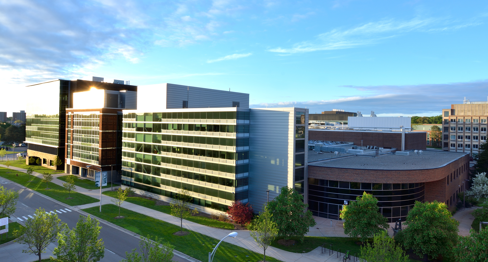

# FRIB-TA Summer School

## A practical walk through formal scattering theory: Connecting bound states, resonances, and scattering states in exotic nuclei and beyond

- Online, August 4-6, 2021.
- [Indico Event Page](https://indico.frib.msu.edu/event/43/)

## Brief description

Scattering theory is a framework connecting seemingly different phenomena of the quantum world such as stable bound states, resonances, elastic scattering, and reactions. It has applications in many areas of physics, ranging from hadrons and nuclear physics to the description of ultracold atomic systems. In particular, scattering theory provides the foundation for few- and many-body approaches that solve quantum problems from first principles, and it is an essential ingredient for the description of low-energy nuclear reactions that will be studied at the Facility for Rare Isotope Beams (FRIB).

This summer school will offer an introduction to nonrelativistic quantum scattering theory, discussing its fundamental assumptions and techniques guided by concrete applications. Formal aspects, centered around the important concept of the S-matrix, will be covered in detail, complemented at each step by numerical illustrations and hands-on programming exercises.

At the end of this three-day course, participants will have a firm understanding of the basic concepts of scattering theory, how they relate to a variety of few- and many-body quantum systems, and how they can be implemented numerically for simple examples.

## Teachers and local organization

### Lecturers/Organizers:
- [Sebastian K&ouml;nig](https://skoenig.wordpress.ncsu.edu/), North Carolina State University, USA
- [Kevin Fossez](https://www.phy.anl.gov/theory/staff/kfossez/kfossez.html), FRIB, Michigan State University, and Argonne National Laboratory, USA
- [Heiko Hergert](https://pa.msu.edu/profile/hergert/), FRIB, Michigan State University, USA

## Schedule and material

### Day 1

- **D1, M1 (9:00am-10:30am EDT): lecture**
  - Introduction ([slides](slides/intro.pdf))
  - Math and physics review ([slides](slides/lecture_FRIBTA_scatt_th_reminder.pdf))
- Break (10:30am-11:00am EDT)
- **D1, M2 (11:00am-12:30pm EDT): lecture**
  - Lippmann-Schwinger equation ([slides](slides/lseq.pdf))
- Break (12:30pm-1:30pm EDT)
- **D1, A1 (1:30pm-3:00pm EDT): lecture**
  - Radial Schrödinger equation ([slides](slides/radseq.pdf))
- Break (3:00pm-3:30pm EDT)
- **D1, A2 (3:30pm-5:00pm EDT): lab**
  - Scattering wavefunctions

### Day 2

- **D2, M1 (9:00am-10:30am EDT): lecture**
  - Lippmann-Schwinger equation (continued)
  - Analytic continuation ([slides](slides/contour.pdf))
- Break (10:30am-11:00am EDT)
- **D2, M2 (11:00am-12:30pm EDT): lab**
  - Bound states and virtual states
- Break (12:30pm-1:30pm EDT)
- **D2, A1 (1:30pm-3:00pm EDT): lecture**
  - Quasi-stationary formalism I ([slides](slides/lecture_FRIBTA_scatt_th_QSF_I.pdf))
- Break (3:00pm-3:30pm EDT)
- **D2, A2 (3:30pm-5:00pm EDT): lab**

### Day 3

- **D3, M1 (9:00am-10:30am EDT): lecture**
  - Quasi-stationary formalism II ([slides](slides/lecture_FRIBTA_scatt_th_QSF_II.pdf))
- Break (10:30am-11:00am EDT)
- **D3, M2 (11:00am-12:30pm EDT): lab**
- Break (12:30pm-1:30pm EDT)
- **D3, A1 (1:30pm-3:00pm EDT): lecture**
  - Few- and many-body calculations ([slides](slides/lecture_FRIBTA_scatt_th_MB.pdf))
- Break (3:00pm-3:30pm EDT)
- **D3, A2 (3:30pm-5:00pm EDT): lab**

---

This [FRIB-TA](https://fribtheoryalliance.org/) school is made possible with generous funding from the Facility for Rare Isotope Beams ([FRIB](https://frib.msu.edu/)), USA.
